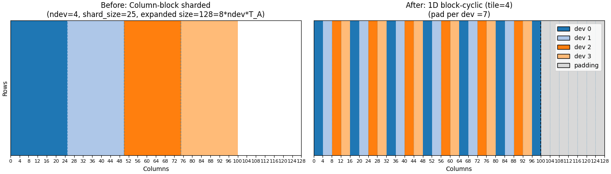

# Distributed Linear Solver with cusolverMg and Jax

This code provides a C++ interface between jax and cusolverMg, a distributed linear solver
provided by NVIDIA. Calling the distributed solver requires laying out matrices in
1D block cyclic, column major form, which we handle on the Jax side with a single all-to-all call in
combination with `jax.shard_map`. 



The provided binary is compiled with `gcc==11.5.0`, `cuda==12.8.0` and `cudnn=9.2.0.82-12`.

Note that jax comes shipped with CUDA 12.x these days, and so I rely on the shipped binaries
that come with jax.

## Install

To install, clone the repo and in the source root use:

```bash
pip install .
```

To verify the package (requires one or more available GPUs), run the pytest command in the source root:

```bash
pytest 
```

While we can check the block cylic remapping by faking multiple CPU devices, we can only check the multi-GPU code when
there are multiple GPUs available. 

## Development

If you want to compile from source for development reasons, then from the source root use:

```bash
mkdir build
cd build
cmake ..
cmake --build . --target install
```

which will install the CUDA binaries into `src/jaxmg/bin`. We rely on [CPM-CMAKE](https://github.com/cpm-cmake/CPM.cmake) 
for managing the packages we rely on (abseil-cpp, jaxlib, XLA) for compilation. Compilation will require at least C++17. 
To only target specific libraries, you can use for example
```bash
cmake ..
cmake --build . --target potrf
cmake --install .
```


## Citation

## Acknowledgements
I acknowledge support from the Flatiron Institute. The Flatiron Institute is a
division of the Simons Foundation.