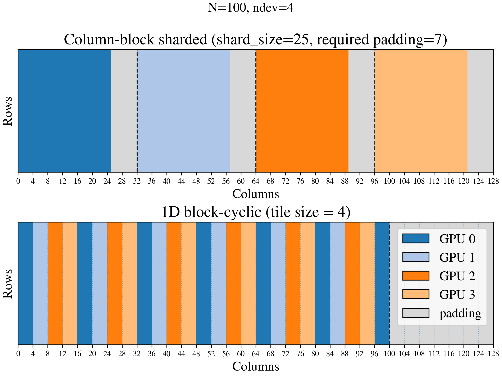
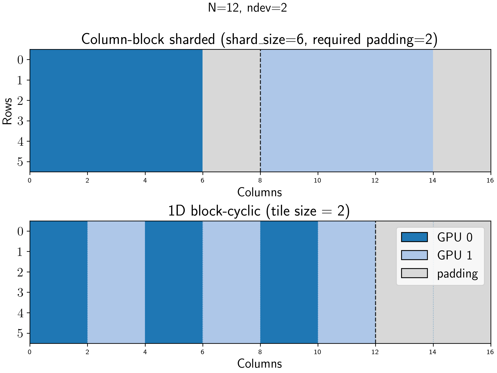

# jaxmg: A distributed linear solver in JAX with cuSolverMg

This repository provides a C++ interface between [JAX](https://github.com/google/jax) and [cuSolverMg](https://docs.nvidia.com/cuda/cusolver/index.html#using-the-cusolvermg-api), NVIDIA’s distributed linear solver.  

To use cuSolverMg, matrices must be stored in **1D block-cyclic, column-major form**. This package handles that transformation on the JAX side with a single **all-to-all** call in combination with `jax.shard_map`.



The provided binary is compiled with:
- **GCC**: 11.5.0  
- **CUDA**: 12.8.0  
- **cuDNN**: 9.2.0.82-12  

> **Note:** JAX ships with CUDA 12.x binaries, which this package relies on. No local version of CUDA is required.

---

## Installation

Clone the repository and install with:

```bash
pip install .
```

## Testing

To verify the installation (requires at least one GPU):

```bash
pytest 
```

CPU-only tests: The block-cyclic remapping is checked by simulating multiple CPU devices.

Multi-GPU tests: Requires multiple available GPUs.

## Simple example

Consider the case where we have 2 GPUs available and we are trying to solve the linear 
system $A\cdot x =b$, where $A$ is an $12\times12$, positive-definite matrix and $b$ corresponds to a vector of ones. Every shard on each GPU will be of size $12\times 6$.
We require a cyclic 1D tiling with tile size `T_A=2` for `cuSolverMg` to work. This 
results in the following layout:



In order to interweave the blocks, we need to ensure that each shard is a multiple of
`ndev * T_A = 4`, so that we can reshape to `(ndev, T_A, ...)` and exchange the blocks via `jax.lax.all_to_all`. We therefore add zero padding of 2 columns to each shard (see top figure). After interweaving the blocks, we are left with extra padding on the right, which we ignore in the solver itself. After the solver is called, we again use a
single `jax.lax.all_to_all` call to remap the data back to block-sharded form. 

As we see in the code below, the interface is simple to use and does not require the user to deal with the cyclic 1d data remapping:

```python
# examples/readme.py
import jax
jax.config.update("jax_enable_x64", True)
import jax.numpy as jnp
from jax.sharding import PartitionSpec as P, NamedSharding
from jaxmg import potrs

# Assumes we have at least one GPU available
devices = jax.devices("gpu")
assert len(devices) in [1, 2], "Example only works for 1 or 2 devices"
N = 12
T_A = 2
dtype = jnp.float64
# Create diagonal matrix and `b` all equal to one
A = jnp.diag(jnp.arange(N, dtype=dtype) + 1)
b = jnp.ones((N, 1), dtype=dtype)
ndev = len(devices)
# Make mesh and place data (columns sharded)
mesh = jax.make_mesh((ndev,), ("x",))
A = jax.device_put(A, NamedSharding(mesh, P(None, "x")))
b = jax.device_put(b, NamedSharding(mesh, P(None, None)))
# Call potrf
out = potrs(A, b, T_A=T_A, mesh=mesh, in_specs=(P(None, "x"), P(None, None)))
expected_out = 1.0 / (jnp.arange(N, dtype=dtype) + 1)
print(jnp.allclose(out.flatten(), expected_out))
```
which should print
```bash
True
```

> **Note:** When multiple GPUs are available, we initialize the device communcation when `jaxmg` is imported, which can take a couple of seconds.


## Current limitations

The current version of `jaxmg` has the following limitations:

- **No Hermitian matrices:** We currently only have support for symmetric matrices. Complex numbers are supported on the cuSolverMg side, but would require some more development to deal with the XLA data strucutres jax provides.

- **Potential invalid tilings:** It is possible that for a given $N\times N$ matrix the provided `T_A` does not allow one to use a single `jax.lax.all_to_all` call to bring the matrix to cyclic 1D form. In this case we raise an error, and suggest both a smaller and larger `T_A` that would enable the data remapping. This problem mostly occurs for small matrices, where the number of tiles is small and `T_A` is close to the shard size.

- **Maximum tilings:** If the tiling `T_A` is too small, the solver can slow down significantly. In the cuSolverMg documentation, the recommended value for `T_A` is "256 or above". There is no maximum value of `T_A` for `jaxmg.potrs` and `jaxmg.potri`. However, for the symmetric eigensolver `jaxmg.syevd`, the maximum value of `T_A` equals 1024.

- **Maximum number of GPUs:** According to the cuSolverMg documentation, the current maximum number of GPUs is 16. Going beyond this value will raise a an error from within CUDA code.

- **No multi-node communcation:** We are currently restricted to a single node. However, as of CUDA 13, there is a new distributed linear algebra library called [cuSolverMp](https://docs.nvidia.com/cuda/cusolvermp/) with similar capabilities as cuSolverMg, that does support multi-node computations as well as >16 devices. Given the similarities in syntax, it should be straightforward to also eventually support this. The only complication is that cuSolverMp requires the matrix to be sharded in cyclic 2D form.


## Development

To build from source:

```bash
mkdir build
cd build
cmake ..
cmake --build . --target install
```

This installs the CUDA binaries into src/jaxmg/bin.

Dependencies are managed with [CPM-CMAKE](https://github.com/cpm-cmake/CPM.cmake),
including **abseil-cpp**, **jaxlib**, **XLA** for compilation. Compilation requires C++20 or later.
To build specific targets only, for example potrs:
```bash
cmake ..
cmake --build . --target potrs
cmake --install .
```


## Citation
(Citation details will be available soon.)

## Acknowledgements
I acknowledge support from the Flatiron Institute. The Flatiron Institute is a
division of the Simons Foundation.